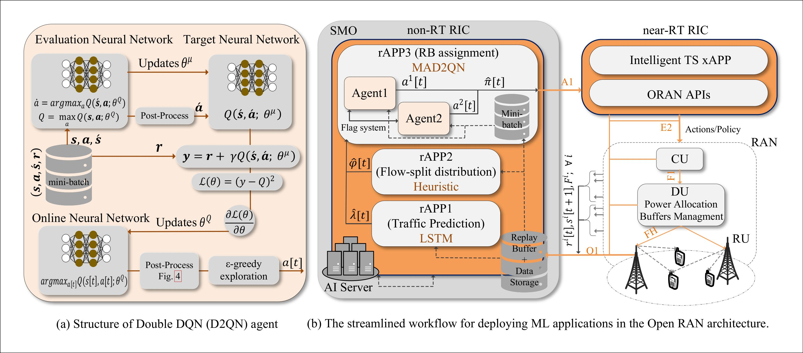
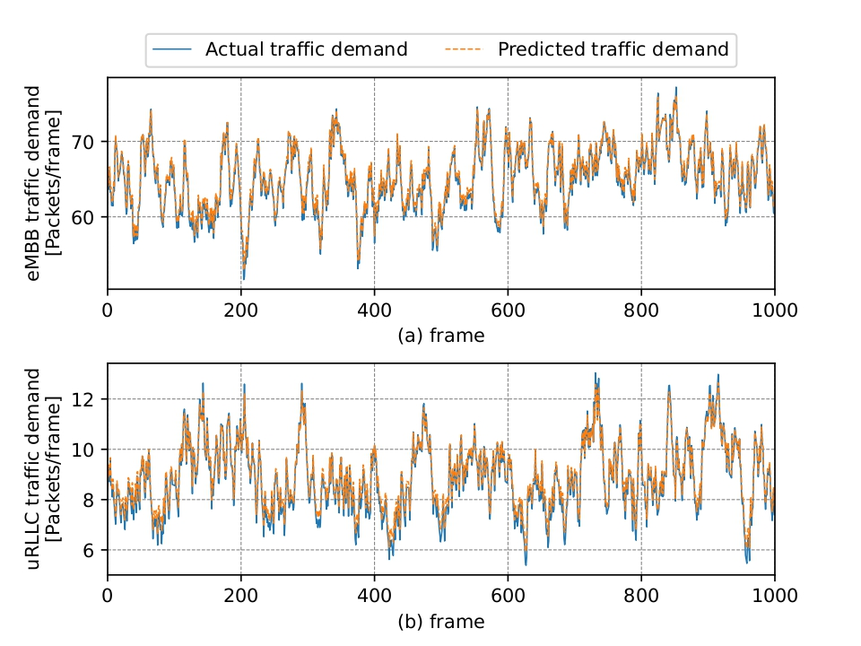

# Empowering Traffic Steering in 6G Open RAN with Deep Reinforcement Learning

This repository contains the implementation and simulation framework accompanying the paper:

> **Empowering Traffic Steering in 6G Open RAN with Deep Reinforcement Learning**  
> IEEE Transactions on Wireless Communications, 2024.

The work proposes an intelligent Traffic Steering (TS) framework for 6G Open RAN systems using Deep Reinforcement Learning (DRL), targeting efficient resource utilization and QoS-aware service provisioning for heterogeneous traffic (eMBB and uRLLC).

---

## 📌 Overview

Future 6G networks must support heterogeneous services with strict and conflicting requirements. Open RAN enables programmable control via RAN Intelligent Controllers (RIC), where intelligent xApps can dynamically steer traffic.

This repository provides:

- A simulation environment modeling multi-RU Open RAN scenarios
- DRL-based traffic steering agents
- Baseline comparison methods
- Evaluation scripts to reproduce key performance metrics

---

## 🧠 Key Features

- ✅ Open RAN–compliant traffic steering formulation
- ✅ MDP-based modeling of TS problem
- ✅ Deep Reinforcement Learning agent implementation
- ✅ Support for heterogeneous traffic (eMBB, uRLLC)
- ✅ QoS-aware reward design
- ✅ Performance evaluation and visualization tools

---

## 🏗 System Model

The framework models:

- Multiple Radio Units (RUs)
- Multiple User Equipments (UEs)
- Dynamic traffic arrivals
- Queue-aware scheduling
- Service differentiation (eMBB throughput / uRLLC latency)

The traffic steering decision is formulated as a Markov Decision Process (MDP):

- **State**: Traffic load, channel conditions, queue lengths, RU utilization
- **Action**: Steering decision (user-to-RU/slice assignment)
- **Reward**: Weighted objective balancing throughput and latency constraints

---

## 📂 Repository Structure
```
.
├── README.md
├── src
│   ├── main
│   ├── LSTM
│   └── topology
├── benchmarks
│   ├── fix_num
│   ├── frq_domain
│   ├── time_domain
│   └── Uniform_varphi
├── Figures
│   ├── Result.pdf
│   ├── Result1.pdf
│   └── System model.pdf
└── requirements.txt
```
Below you can see the system architecture and some parts of the designed DRL and LSTM models:



## Reference: 
If you use this code in your research, please cite:
```
@ARTICLE{10528242,
  author={Kavehmadavani, Fatemeh and Nguyen, Van-Dinh and Vu, Thang X. and Chatzinotas, Symeon},
  journal={IEEE Transactions on Wireless Communications}, 
  title={Empowering Traffic Steering in 6G Open RAN With Deep Reinforcement Learning}, 
  year={2024},
  volume={23},
  number={10},
  pages={12782-12798},
  doi={10.1109/TWC.2024.3396273}}
```
  


